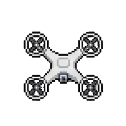
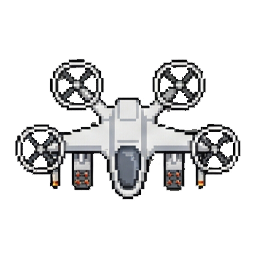
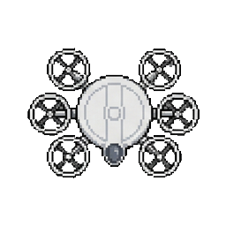
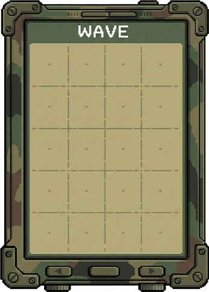
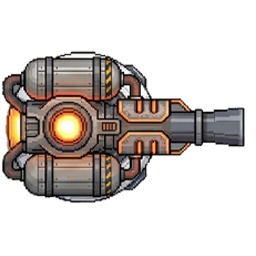
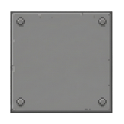

#  DroneFront - Tower Defense

**DroneFront** é um jogo de estratégia do tipo Tower Defense desenvolvido em Java utilizando a biblioteca gráfica JavaFX.  
O objetivo é proteger sua base de ondas de drones inimigos, construindo e aprimorando torres defensivas de forma estratégica.

##  Sobre o Projeto

Este jogo foi desenvolvido como parte da disciplina de Linguagem de Programação Orientada a Objetos (LPOO), no semestre 2025.2.  
O projeto aplica conceitos de orientação a objetos, gerenciamento de dependências com Maven e interfaces gráficas modernas.

**Desenvolvedor:** Eliton Sena de Souza  
**Orientação:** Prof. Leandro Honorato de Souza Silva

##  Requisitos

### Para Jogadores (Apenas jogar)
- Java Runtime Environment (JRE) 21 ou superior instalado.
- Sistema Operacional: Windows, Linux ou macOS.

### Para Desenvolvedores (Compilar e Modificar)
Se desejar aprender como compilar e configurar o projeto para desenvolvimento, acesse o guia completo de build:  
➡️ **[Guia de Build e Execução](docs/BUILD.md)**

##  Baixar e Jogar

A forma mais rápida de jogar é baixar o executável diretamente:

👉 **[Download do Executável no GitHub Releases](https://github.com/ElitonSena/DroneFront/releases/)**

##   Controles e Jogabilidade

### 🖱️ Mouse
- **Clique Esquerdo (Terreno Livre):** Constrói a torre selecionada (se houver dinheiro)
- **Clique Esquerdo (Torre Existente):** Realiza Upgrade da torre
- **Clique Esquerdo (Modo Venda):** Vende a torre e recupera parte do custo inicial

### ⌨️ Atalhos de Teclado
| Tecla | Ação |
|||
| 1 | Seleciona Gun Tower |
| 2 | Seleciona PEM Tower |
| 3 | Seleciona Fire Tower |
| 4 | Modo Vender |
| ESC | Pausar / Menu |
##  Arsenal e Inimigos

### Torres
- **Gun Tower:** Baixo custo, alta cadência de tiro
- **PEM Tower:** Pulso eletromagnético que reduz velocidade
- **Fire Tower:** Dano contínuo em área (Burn)

### Inimigos
- **Scout Drone:** Rápido, pouca vida
- **Bomber Drone:** Equilibrado
- **Tank Drone:** Muito resistente e lento

##  Histórico de Atualizações

`20/09`: Atualmente os inimigos apenas percorrem o caminho e causam dano, o jogo termina ao zerar vida. (Entrega 1)  
`28/10`: Implementei a lógica de adição/remoção de torres, dano com projéteis e economia inicial. (Entrega 2)  
`15/11`: Adicionei mais inimigos, torres e ondas, implementei um sistema de upgrade e melhorei alguns mecânicas de dano e vulnerabilidade. O spawm de inimigos nas ondas agora é declarado por metodos probabilísticos, adicionando um certo nível de aleatoriedade. (Entrega 3)  
`29/11`: 

OBS: As justificativa de design e o diagrama de cada entrega estão em `docs/`